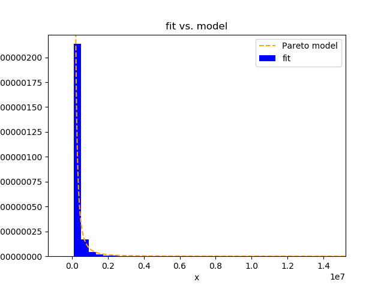
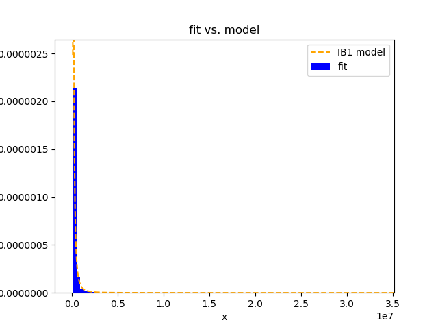
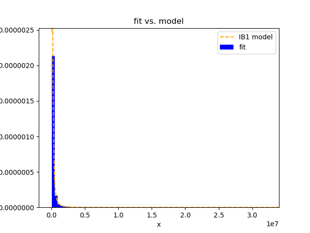

# Pareto2GBfit

This small package provides distributions and functions to fit 4 of the
Generalized Beta distribution family. The theoretical framework bases on
the paper by McDonald, J. B. and Xu, Y. J. (1995) ‘A generalization of
the beta distribution with applications’ (Journal of Econometrics,
66(1), pp. 133–152). With this package one can test the equality of the
parameters in the GB tree when we focus on the Pareto branch.

GB tree: 


(Source: Wikipedia)

## Requirements
Python 3.7 or later with the following `pip3 install -U -r requirements.txt` packages:

- `numpy`
- `scipy`
- `matplotlib`
- `progressbar`
- `prettytable`


## Distributions

Following functions are implemented:

|        	| pdf                        	| cdf                                                  	| icdf                                             	| Jacobian              	| Hessian                	|
|--------	|----------------------------	|------------------------------------------------------	|--------------------------------------------------	|-----------------------	|------------------------	|
| Pareto 	| `Pareto_pdf(x, b, p)`      	| `Pareto_cdf(x, b, p)` `Pareto_cdf_ne(x, b, p)`       	| `Pareto_icdf(u, b, p)` `Pareto_icdf_ne(x, b, p)` 	| `Pareto_jac(x, b, p)` 	| `Pareto_hess(x, b, p)` 	|
| IB1    	| `IB1_pdf(x, b, p, q)`      	| `IB1_cdf(x, b, p, q)`                                	| `IB1_icdf_ne(x, b, p, q)`                        	| `IB1_jac(x, b, p, q)` 	| --                     	|
| GB1    	| `GB1_pdf(x, a, b, p, q)`   	| `GB1_cdf(x, a, b, p, q)` `GB1_cdf_ne(x, a, b, p, q)` 	| `GB1_icdf_ne(x, a, b, p, q)`                     	| --                    	| --                     	|
| GB     	| `GB_pdf(x, a, b, c, p, q)` 	| `GB_cdf_ne(x, a, b, c, p, q)`                        	| `GB_icdf_ne(x, a, b, c, p, q)`                   	| --                    	| --                     	|


## Fitting

To fit the distributions, the package provides following functions:

|        	| fit  &nbsp; &nbsp; &nbsp; |
|--------	|--------------------------	|
| Pareto 	| `Paretofit(x, b, x0, ...)`|
| IB1    	| `IB1fit(x, b, x0, ...)`   |
| GB1    	| `GB1fit(x, b, x0, ...)`   |
| GB     	| `GBfit(x, b, x0, ...)`    |

with following options:

| arg                    | default                                                                                                                                                                 | description                                                                                                                                                                                                                                                                                                                                                         |
|------------------------|-------------------------------------------------------------------------------------------------------------------------------------------------------------------------|---------------------------------------------------------------------------------------------------------------------------------------------------------------------------------------------------------------------------------------------------------------------------------------------------------------------------------------------------------------------|
|           `x`          |                                                                                    --                                                                                   | actual data                                                                                                                                                                                                                                                                                                                                                         |
|           `b`          |                                                                                    --                                                                                   | lower bound                                                                                                                                                                                                                                                                                                                                                         |
|      `bootstraps`      |                                                                              `500` (`250` for GB1, GB)                                                                  | number of bootstraps, for Pareto and IB1 default =500, for GB1, GB =250, the more parameters one need to optimize, to more time-consuming will the optimization take. Thus, less bootstraps are set as default.                                                                                                                                                     |
|        `method`        |                                                                                 `SLSQP`                                                                                 | either run `SLSQP` (= local optimization with bounds, constraints, much faster), or chose 'L-BFGS-B' which bases on Basin-Hopping (=global optimization) . Note that depending on the selected method different optimization options are available (see [SciPy's documentation](https://docs.scipy.org/doc/scipy/reference/generated/scipy.optimize.minimize.html)) |
|   `verbose_bootstrap`  |                                                                                 `False`                                                                                 | display each bootstrap round                                                                                                                                                                                                                                                                                                                                        |
|          `ci`          |                                                                                  `True`                                                                                 | display fitted parameters with 95th confidence intervals                                                                                                                                                                                                                                                                                                            |
|        `verbose`       |                                                                                  `True`                                                                                 | display any results, if set `False`, no output is printed                                                                                                                                                                                                                                                                                                           |
|          `fit`         |                                                                                 `False`                                                                                 | display goodness of fit measures in a table (aic, bic, mae, mse, rmse, rrmse, ll, n)                                                                                                                                                                                                                                                                                |
|         `plot`         |                                                                                 `False`                                                                                 | If `True`, a graph of the fit will be plottet, graphical cosmetics can be adjusted with the dictionary `plot_cosmetics`                                                                                                                                                                                                                                             |
|   `return_parameters`  |                                                                                 `False`                                                                                 | If `True`, fitted parameters with standard errors are returned. E.g. `Paretofit(...)` would return the 1x2-array: `=[p_fit, p_se]`, `IB1fit(...)` 1x4-array: `=[p_fit, p_se, q_fit, p_se]`, etc.                                                                                                                                                                    |
|      `return_gof`      |                                                                                 `False`                                                                                 | If `True`, goodness of fit measures are returned. 1x8-array: `=[aic, bic, mae, mse, rmse, rrmse, ll, n]`                                                                                                                                                                                                                                                            |
|    `plot_cosmetics`    | `{'bins': 50, 'col_fit': 'blue', 'col_model': 'orange'}`                                                                                                                | Specify bins by adding the dictionary `plot_cosmetics={'bins': 250}`                                                                                                                                                                                                                                                                                                |
| `basinhopping_options` | `{'niter': 20, 'T': 1.0, 'stepsize': 0.5, 'take_step': None, 'accept_test': None, 'callback': None, 'interval': 50, 'disp': False, 'niter_success': None, 'seed': 123}` | if `method='basinhopping'`, the user can specify arguments to the optimizer which are then passed to `scipy.optimize.basinhopping`. For further information, refer to [SciPy's documentation](https://docs.scipy.org/doc/scipy/reference/generated/scipy.optimize.basinhopping.html#scipy.optimize.basinhopping).                                                   |
|     `SLSQP_options`    | `{'jac': None, 'tol': None, 'callback': None, 'func': None, 'maxiter': 300, 'ftol': 1e-14, 'iprint': 1, 'disp': False, 'eps': 1.4901161193847656e-08}`                  | if `method='SLSQP'`, the user can specify arguments to the optimizer which are then passed to `scipy.optimize.minimize(method='SLSQP', ...)`. For further information, refer to [SciPy's documentation](https://docs.scipy.org/doc/scipy/reference/optimize.minimize-slsqp.html).                                                                                   |

## Examples

### Example 1

Lets generate a pareto distributed dataset for which we know the true parameters. Then, we run the `Paretofit()`-function and expect that the model with the true parameters will be fitted to the data.

1. Load packages
```
import numpy as np
from Pareto2GBfit.fitting import *
```
2. Specify parameters for synthetic dataset
```
b, p = 500, 2.5
```
3. Linspace
```
n = 10000
xmin = 0.1
xmax = 10000
x = np.linspace(xmin, xmax, n)
```
4. Generate synthetic dataset, e.g. that is pareto distributed
```
data = Pareto_icdf(u, b, p)
```
5. Run optimization
```
Paretofit(x=data, b=500, x0=2, bootstraps=1000, method='SLSQP')
```
this returns following output:

```
Bootstrapping 100%|##############################################|Time: 0:00:04
+-----------+--------+--------+---------+--------+---------+---------+-------+
| parameter | value  |   se   |    z    | P>|z|  | cilo_95 | cihi_95 |   n   |
+-----------+--------+--------+---------+--------+---------+---------+-------+
|     p     | 2.4764 | 0.0247 | 100.457 | 0.0000 |  2.4281 |  2.5247 | 10000 |
+-----------+--------+--------+---------+--------+---------+---------+-------+
```

### Example 2

Lets load the netwealth-dataset and fit the Pareto- and the IB1-distribution to the data.
Then, we test the equality of the shared parameter p.

1. Load packages
```
from Pareto2GBfit.fitting import *
import numpy as np
from scipy.stats import describe
```
2. Load dataset
```
netwealth = np.loadtxt("netwealth.csv", delimiter = ",")
```
3. Describe dataset
```
describe(netwealth)
```
this returns following:
```
DescribeResult(nobs=28072, minmax=(-4434000.0, 207020000.0), mean=142245.32003419776, variance=6263377257629.95, skewness=69.73674629459225, kurtosis=5340.710623236435)
```

4. Lets fit the Pareto distribution to the data
```
Paretofit(x=netwealth, b=100000, x0=1, bootstraps=1000, method='SLSQP', fit=True, plot=True, plot_cosmetics={'bins': 500})
```
Output:
```
Bootstrapping 100%|##############################################|Time: 0:00:03
+-----------+--------+--------+---------+--------+---------+---------+------+
| parameter | value  |   se   |    z    | P>|z|  | cilo_95 | cihi_95 |  n   |
+-----------+--------+--------+---------+--------+---------+---------+------+
|     p     | 1.2003 | 0.0127 | 94.5339 | 0.0000 |  1.1755 |  1.2252 | 7063 |
+-----------+--------+--------+---------+--------+---------+---------+------+
+-----+-------------+-------------+------------+--------------------+---------------+--------+-------------+------+
|     |     AIC     |     BIC     |    MAE     |        MSE         |      RMSE     | RRMSE  |      LL     |  n   |
+-----+-------------+-------------+------------+--------------------+---------------+--------+-------------+------+
| GOF | 185948.2486 | 185955.1112 | 793147.028 | 551367829496230.94 | 23481222.9131 | 4.6038 | -92973.1243 | 7063 |
+-----+-------------+-------------+------------+--------------------+---------------+--------+-------------+------+

```



5. Lets go one parameter level upwards in the GB-tree and fit the IB1 distribution
```
IB1fit(x=netwealth, b=100000, x0=(1,1), bootstraps=1000, method='SLSQP', fit=True, plot=True, plot_cosmetics={'bins': 500})
```
Output:
```
Bootstrapping 100%|##############################################|Time: 0:00:14
+-----------+--------+--------+---------+--------+---------+---------+------+
| parameter | value  |   se   |    z    | P>|z|  | cilo_95 | cihi_95 |  n   |
+-----------+--------+--------+---------+--------+---------+---------+------+
|     p     | 1.4464 | 0.0254 | 57.0174 | 0.0000 |  1.3966 |  1.4961 | 7063 |
|     q     | 1.3022 | 0.0219 | 59.4884 | 0.0000 |  1.2593 |  1.3451 | 7063 |
+-----------+--------+--------+---------+--------+---------+---------+------+
+-----+-------------+-------------+-------------+--------------------+--------------+--------+------------+------+
|     |     AIC     |     BIC     |     MAE     |        MSE         |     RMSE     | RRMSE  |     LL     |  n   |
+-----+-------------+-------------+-------------+--------------------+--------------+--------+------------+------+
| GOF | 185686.9459 | 185700.6712 | 549988.3777 | 22899226860951.406 | 4785313.6638 | 4.0645 | -92841.473 | 7063 |
+-----+-------------+-------------+-------------+--------------------+--------------+--------+------------+------+

```


6. Lets run the global optimization of the `IB1fit()` and compare this result to the local optimization in step 5.
```
IB1fit(x=netwealth, b=100000, x0=(1,1), bootstraps=1000, method='L-BFGS-B', fit=True, plot=True, plot_cosmetics={'bins': 500}, basinhopping_options={'niter': 50, 'stepsize': .75})
```
Output:
```
Bootstrapping 100%|##############################################|Time: 0:05:09
+-----------+--------+--------+---------+--------+---------+---------+------+
| parameter | value  |   se   |    z    | P>|z|  | cilo_95 | cihi_95 |  n   |
+-----------+--------+--------+---------+--------+---------+---------+------+
|     p     | 1.4479 | 0.0251 | 57.6374 | 0.0000 |  1.3987 |  1.4971 | 7063 |
|     q     | 1.3038 | 0.0223 | 58.5595 | 0.0000 |  1.2602 |  1.3475 | 7063 |
+-----------+--------+--------+---------+--------+---------+---------+------+
+-----+-------------+-------------+-------------+--------------------+--------------+--------+-------------+------+
|     |     AIC     |     BIC     |     MAE     |        MSE         |     RMSE     | RRMSE  |      LL     |  n   |
+-----+-------------+-------------+-------------+--------------------+--------------+--------+-------------+------+
| GOF | 185686.9583 | 185700.6836 | 541010.4802 | 22794194873280.457 | 4774326.6408 | 4.0531 | -92841.4792 | 7063 |
+-----+-------------+-------------+-------------+--------------------+--------------+--------+-------------+------+
```
Note that the global optimization process took about 5 mins compared to the local optimization with 14 seconds.
Indeed, both optimizations result in the same parameters.



7. Save the fitted parameters, e.g. for Pareto, IB1, GB1
```
p_fit1, p_se1 = Paretofit(x=netwealth, b=100000, x0=1, bootstraps=250, method='SLSQP', verbose=False, return_parameters=True)
p_fit2, p_se2, q_fit2, q_se2 = IB1fit(x=netwealth, b=100000, x0=(1,1), bootstraps=250, method='SLSQP', verbose=False, return_parameters=True)
a_fit3, a_se3, p_fit3, p_se3, q_fit3, q_se3 = GB1fit(x=netwealth, b=100000, x0=(-0.5,1,1), bootstraps=250, method='SLSQP', verbose=False, return_parameters=True)
```

Output:
```
Bootstrapping 100%|##############################################|Time: 0:00:00
Bootstrapping 100%|##############################################|Time: 0:00:04
Bootstrapping 100%|##############################################|Time: 0:01:08
```

8. Finally, lets test the validity of the GB tree restriction
```
LRtest(Pareto(x=netwealth, b=b, p=p_fit1).LL, IB1(x=netwealth, b=b, p=p_fit2, q=q_fit2).LL, df=2)
```
Output:
```
+-------------+-----------+
|   LR test   |           |
+-------------+-----------+
|  chi2(2) =  | -263.3104 |
| Prob > chi2 |   1.0000  |
+-------------+-----------+
```
We highly cannot reject the null that the GB tree restriction q=1 is not valid.

```
LRtest(Pareto(x=netwealth, b=b, p=p_fit1).LL, GB1(x=netwealth, b=b, a=a_fit3, p=p_fit3, q=q_fit3).LL, df=3)
```
Output:
```
+-------------+----------+
|   LR test   |          |
+-------------+----------+
|  chi2(3) =  | 461.9817 |
| Prob > chi2 |  0.0000  |
+-------------+----------+
```
We can highly reject the null that the GB tree restrictions a=-1 and q=1 are valid.


```
LRtest(IB1(x=netwealth, b=b, p=p_fit2, q=q_fit2).LL, GB1(x=netwealth, b=b, a=a_fit3, p=p_fit3, q=q_fit3).LL, df=3)
```
Output:
```
+-------------+----------+
|   LR test   |          |
+-------------+----------+
|  chi2(3) =  | 725.2921 |
| Prob > chi2 |  0.0000  |
+-------------+----------+
```
We can highly reject the null that the GB tree restriction a=-1 is valid.


### Author
Fabian Nemeczek, Freie Universität Berlin
