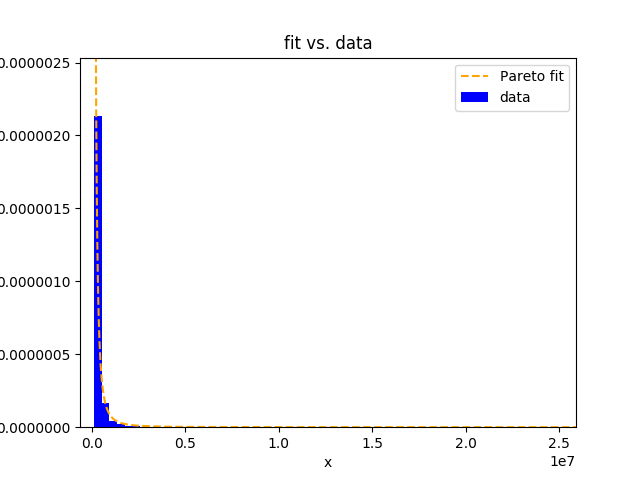
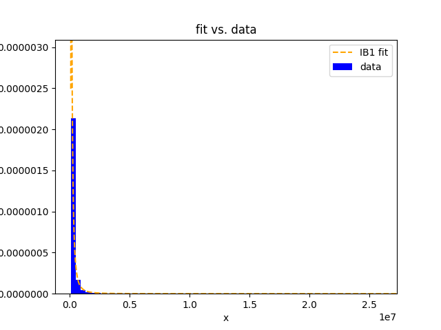

# Pareto2GBfit

This small package provides distributions and functions to fit 4
distributions of the Generalized Beta distribution family. The
implemented distributions are the Pareto, the IB1, the GB1 and the GB
distribution and are situated in the Pareto branch. These distributions
are suitable to model the top tails for instance of income and wealth
distributions. With this package one can test the parameter restriction
in the GB tree when focussing on the Pareto branch.

The theoretical framework bases on the paper by McDonald, J. B. and Xu,
Y. J. (1995) ‘A generalization of the beta distribution with
applications’ (Journal of Econometrics, 66(1), pp. 133–152).

GB tree: 


(Source: Wikipedia)

## Requirements
Python 3.7 or later with the following `pip3 install -U -r requirements.txt` packages:

- `numpy`
- `scipy`
- `matplotlib`
- `progressbar`
- `prettytable`


## Distributions

Following functions are implemented:

|        	| pdf                        	| cdf                                                  	| icdf                                             	| Jacobian              	| Hessian                	|
|--------	|----------------------------	|------------------------------------------------------	|--------------------------------------------------	|-----------------------	|------------------------	|
| Pareto 	| `Pareto_pdf(x, b, p)`      	| `Pareto_cdf(x, b, p)` `Pareto_cdf_ne(x, b, p)`       	| `Pareto_icdf(u, b, p)` `Pareto_icdf_ne(x, b, p)` 	| `Pareto_jac(x, b, p)` 	| `Pareto_hess(x, b, p)` 	|
| IB1    	| `IB1_pdf(x, b, p, q)`      	| `IB1_cdf(x, b, p, q)`                                	| `IB1_icdf_ne(x, b, p, q)`                        	| `IB1_jac(x, b, p, q)` 	| --                     	|
| GB1    	| `GB1_pdf(x, a, b, p, q)`   	| `GB1_cdf(x, a, b, p, q)` `GB1_cdf_ne(x, a, b, p, q)` 	| `GB1_icdf_ne(x, a, b, p, q)`                     	| --                    	| --                     	|
| GB     	| `GB_pdf(x, a, b, c, p, q)` 	| `GB_cdf_ne(x, a, b, c, p, q)`                        	| `GB_icdf_ne(x, a, b, c, p, q)`                   	| --                    	| --                     	|


## Fitting

To fit the distributions, the package provides following functions:

|        	| fit  &nbsp; &nbsp; &nbsp; |
|--------	|--------------------------	|
| Pareto 	| `Paretofit(x, b, x0, ...)`|
| IB1    	| `IB1fit(x, b, x0, ...)`   |
| GB1    	| `GB1fit(x, b, x0, ...)`   |
| GB     	| `GBfit(x, b, x0, ...)`    |

with following options:

| arg                    | default                                                                                                                                                                 | description                                                                                                                                                                                                                                                                                                                                                         |
|------------------------|-------------------------------------------------------------------------------------------------------------------------------------------------------------------------|---------------------------------------------------------------------------------------------------------------------------------------------------------------------------------------------------------------------------------------------------------------------------------------------------------------------------------------------------------------------|
|           `x`          |                                                                                    --                                                                                   | actual data, will be converted to a numpy.array                                                                                                                                                                                                                                                                                                                     |
|           `b`          |                                                                                    --                                                                                   | lower bound                                                                                                                                                                                                                                                                                                                                                         |
|        `weights`       |                                                                              `array([1., 1.,...])`                                                                      | array with frequency weights, default is a `numpy.ones` array of same shape as `x`. Note that that each observation in x is "inflated" w-times. Thus, all elements in `weights` needs to be integer, and, ideally `numpy.int64` to prevent loss of precision.                                                                                                                    |
|        `weighting`     |                                                                              `multiply`                                                                                 | if 'weights' are applied, specify how to internally handle weights. Per default, `x` is multiplied `weights` internally. Other option: `expand` where `x` is expanded by its weight but is much more computational intense.                                                                                                                                         |
|      `bootstraps`      |                                                                              size of x>b                                                                                | default is size of x when x is cut at b (x>b). You can specify one number for all 4 models, or an array with 2 numbers (first two: Pareto+IB1, last two: GB1+GB), or an array with 4 numbers in this order: Pareto, IB1, GB1, GB. Note that if `weights` are applied, you may specify smaller bootstraps to save computational time.                                |
|        `method`        |                                                                                 `SLSQP`                                                                                 | either run `SLSQP` (= local optimization with bounds, constraints, much faster), or chose 'basinhopping' which bases applies standard `SLSQP` in combination with Basin-Hopping (global optimization technique). Note that depending on the selected method different optimization options are available (see [SciPy's documentation](https://docs.scipy.org/doc/scipy/reference/generated/scipy.optimize.minimize.html)) |
|   `verbose_bootstrap`  |                                                                                 `False`                                                                                 | display each bootstrap round                                                                                                                                                                                                                                                                                                                                        |
|          `ci`          |                                                                                  `True`                                                                                 | display fitted parameters with 95th confidence intervals                                                                                                                                                                                                                                                                                                            |
|     `omit_missings`    |                                                                                  `True`                                                                                 | omits missings which are declared as `NaN`                                                                                                                                                                                                                                                                                                              |
|        `verbose`       |                                                                                  `True`                                                                                 | display any results, if set `False`, no output is printed                                                                                                                                                                                                                                                                                                           |
|          `fit`         |                                                                                 `False`                                                                                 | display goodness of fit measures in a table (aic, bic, mae, mse, rmse, rrmse, ll, n)                                                                                                                                                                                                                                                                                |
|         `plot`         |                                                                                 `False`                                                                                 | If `True`, a graph of the fit will be plottet, graphical cosmetics can be adjusted with the dictionary `plot_cosmetics`                                                                                                                                                                                                                                             |
|   `return_parameters`  |                                                                                 `False`                                                                                 | If `True`, fitted parameters with standard errors are returned. E.g. `Paretofit(...)` would return the 1x2-array: `=[p_fit, p_se]`, `IB1fit(...)` 1x4-array: `=[p_fit, p_se, q_fit, p_se]`, etc.                                                                                                                                                                    |
|      `return_gof`      |                                                                                 `False`                                                                                 | If `True`, goodness of fit measures are returned. 1x8-array: `=[aic, bic, mae, mse, rmse, rrmse, ll, n]`                                                                                                                                                                                                                                                            |
|    `plot_cosmetics`    | `{'bins': 500, 'col_data': 'blue', 'col_fit': 'orange'}`                                                                                                                | Specify bins by adding the dictionary `plot_cosmetics={'bins': 250}`                                                                                                                                                                                                                                                                                                |
| `basinhopping_options` | `{'niter': 20, 'T': 1.0, 'stepsize': 0.5, 'take_step': None, 'accept_test': None, 'callback': None, 'interval': 50, 'disp': False, 'niter_success': None, 'seed': 123}` | if `method='basinhopping'`, the user can specify arguments to the optimizer which are then passed to `scipy.optimize.basinhopping`. For further information, refer to [SciPy's documentation](https://docs.scipy.org/doc/scipy/reference/generated/scipy.optimize.basinhopping.html#scipy.optimize.basinhopping).                                                   |
|     `slsqp_options`    | `{'jac': None, 'tol': None, 'callback': None, 'func': None, 'maxiter': 300, 'ftol': 1e-14, 'iprint': 1, 'disp': False, 'eps': 1.4901161193847656e-08}`                  | if `method='SLSQP'`, the user can specify arguments to the optimizer which are then passed to `scipy.optimize.minimize(method='SLSQP', ...)`. For further information, refer to [SciPy's documentation](https://docs.scipy.org/doc/scipy/reference/optimize.minimize-slsqp.html).                                                                                   |

Also you can fit the whole Pareto branch with following function:

|            	| fit &nbsp; &nbsp; &nbsp; &nbsp; |
|---------------|---------------------------------|
| Pareto to GB 	| `Paretobranchfit(x, b, x0, ...)`|

This is a wrapper that applies all fit functions above in a row (from Paretofit to GBfit), saves all parameters and GOFs and finally evaluates the fit according the specified rejection criteria (rejection_criterion='LRtest' or `rejection_criterion='AIC'`).
Options:

| arg                    | default                                                                                                                                                                 | description                                                         |
|------------------------|-------------------------------------------------------------------------------------------------------------------------------------------------------------------------|---------------------------------------------------------------------|
| `x`                    | --                                                                                                                                                                      | see above                                                           |
| `b`                    | --                                                                                                                                                                      | see above                                                           |
| `weights`              | `array([1., 1.,...])`                                                                                                                                                   | see above                                                           |
| `weighting`            |                                                                              `multiply`                                                                                 | see above                                                           |
| `rejection_criterion`   | `LRtest`                                                                                                                                                                |                                                                     |
| `alpha`                | `.05`                                                                                                                                                                   | significance level of LR test                                       |
| `bootstraps`      | size of x>b                                                                                | default is size of x when x is cut at b (x>b). You can specify one number for all 4 models, or an array with 2 numbers (first two: Pareto+IB1, last two: GB1+GB), or an array with 4 numbers in this order: Pareto, IB1, GB1, GB|
| `method`               | `SLSQP`                                                                                                                                                                 | see above                                                           |
| `omit_missings`        | `True`                                                                                                                                                                  | see above                                                           |
| `verbose_bootstrap`    | `False`                                                                                                                                                                 | see above                                                           |
| `verbose_single`       | `False`                                                                                                                                                                 | if `True` the output of each fit is displayed                       |
| `verbose`              | `True`                                                                                                                                                                  | rejection summary, table with fitted parameters and gofs are listed |
| `fit`                  | `False`                                                                                                                                                                 | see above                                                           |
| `plot`                 | `False`                                                                                                                                                                 | see above                                                           |
| `return_bestmodel`     | `False`                                                                                                                                                                 | if `True` best model's parameters and gofs are returned             |
| `return_all`           | `False`                                                                                                                                                                 | if `True` all model's parameters and gofs are returned              |
| `return_gof`           | `False`                                                                                                                                                                 | not used                                                            |
| `plot_cosmetics`       | `{'bins': 500, 'col_data': 'blue', 'col_fit': 'orange'}`                                                                                                                 | see above                                                           |
| `basinhopping_options` | `{'niter': 20, 'T': 1.0, 'stepsize': 0.5, 'take_step': None, 'accept_test': None, 'callback': None, 'interval': 50, 'disp': False, 'niter_success': None, 'seed': 123}` | see above                                                           |
| `slsqp_options`        | {'jac': None, 'tol': None, 'callback': None, 'func': None, 'maxiter': 300, 'ftol': 1e-14, 'iprint': 1, 'disp': False, 'eps': 1.4901161193847656e-08}                    | see above                                                           |


## Examples

### Example 1

Lets generate a pareto distributed dataset for which we know the true parameters. Then, we run the `Paretofit()`-function and expect that the model with the true parameters will be fitted to the data.

1. Load packages
```
import numpy as np
from Pareto2GBfit.fitting import *
```
2. Specify parameters for synthetic dataset
```
b, p = 500, 2.5
```
3. Linspace
```
n = 10000
xmin = 0.1
xmax = 10000
x = np.linspace(xmin, xmax, n)
```
4. Noise
```
mu = 0
sigma = 100
random.seed(123)
noise = np.random.normal(mu, sigma, size=n)
```
5. Generate synthetic (noised) dataset, e.g. that is pareto distributed
```
data = Pareto_icdf(u, b, p)
data_noised = Pareto_icdf(u, b, p) + noise
```
6. Run optimization for data
```
Paretofit(x=data, x0=2, b=500, method='SLSQP')
```
Here, the sd are bootstrapped with bootstrapps=n=10.000 as default.
Output:
```
Bootstrapping (Pareto)	100%|#####################################|Time: 0:01:14
+-----------+-------+-------+---------+-------+---------+----------+-------+-------+
| parameter | value |   se  |    z    | P>|z| | CI(2.5) | CI(97.5) |   n   |   N   |
+-----------+-------+-------+---------+-------+---------+----------+-------+-------+
|     p     | 2.478 | 0.025 | 100.831 | 0.000 |  2.430  |  2.527   | 10000 | 10000 |
+-----------+-------+-------+---------+-------+---------+----------+-------+-------+
```
7. Run optimization with less bootstraps

Note that the optimization took 1 minute and 14 seconds. Lets try less
bootstraps, e.g. bootstraps=500, and compare the results.

```
Paretofit(x=data, x0=2, bootstraps=500, b=500, method='SLSQP')
```
```
Bootstrapping (Pareto)	100%|#####################################|Time: 0:00:03
+-----------+-------+-------+---------+-------+---------+----------+-------+-------+
| parameter | value |   se  |    z    | P>|z| | CI(2.5) | CI(97.5) |   n   |   N   |
+-----------+-------+-------+---------+-------+---------+----------+-------+-------+
|     p     | 2.478 | 0.024 | 102.167 | 0.000 |  2.429  |  2.524   | 10000 | 10000 |
+-----------+-------+-------+---------+-------+---------+----------+-------+-------+
```
Here we see that the optimization time took 3 seconds and the fitted
parameter p is the same as above. Only se and the CI vary slightly.

8. Run optimization for data_noised
```
Paretofit(x=data_noise, b=500, method='SLSQP')
```
Output:
```
Bootstrapping (Pareto)	100%|#####################################|Time: 0:01:04
+-----------+-------+-------+---------+-------+---------+----------+------+------+
| parameter | value |   se  |    z    | P>|z| | CI(2.5) | CI(97.5) |  n   |  N   |
+-----------+-------+-------+---------+-------+---------+----------+------+------+
|     p     | 2.098 | 0.019 | 111.760 | 0.000 |  2.062  |  2.136   | 8678 | 8678 |
+-----------+-------+-------+---------+-------+---------+----------+------+------+
```
Note that die observations of `data_noise` reduced from n=10000 to
n=8678. This is due to the gaussian noise and Pareto constraint x>b. The
fitted parameter p reduced to 2.1 due to the noise.

### Example 2

Lets load the netwealth-dataset and fit the Pareto- and the IB1-distribution to the data.
Then, we test the equality of the shared parameter p.

1. Load packages
```
from Pareto2GBfit.fitting import *
import numpy as np
from scipy.stats import describe
```
2. Load dataset
```
netwealth = np.loadtxt("netwealth.csv", delimiter = ",")
```
3. Describe dataset
```
describe(netwealth)
```
this returns following:
```
DescribeResult(nobs=28072, minmax=(-4434000.0, 207020000.0), mean=142245.32003419776, variance=6263377257629.95, skewness=69.73674629459225, kurtosis=5340.710623236435)
```

4. Lets fit the Pareto distribution to the data
```
Paretofit(x=netwealth, b=100000, bootstraps=1000, method='SLSQP', fit=True, plot=True, plot_cosmetics={'bins': 500})
```
Output:
```
Bootstrapping (Pareto)	100%|#####################################|Time: 0:00:06
+-----------+-------+-------+--------+-------+---------+----------+------+------+
| parameter | value |   se  |   z    | P>|z| | CI(2.5) | CI(97.5) |  n   |  N   |
+-----------+-------+-------+--------+-------+---------+----------+------+------+
|     p     | 1.200 | 0.014 | 88.567 | 0.000 |  1.175  |  1.228   | 7063 | 7063 |
+-----------+-------+-------+--------+-------+---------+----------+------+------+
+-----+------------+------------+------------+--------------------+-------------+-------+------------+---------------+------------+--------------------+------------+--------------------+------+------+
|     |    AIC     |    BIC     |    MAE     |        MSE         |     RMSE    | RRMSE |     LL     | sum of errors | emp. mean  |     emp. var.      | pred. mean |     pred. var.     |  n   |  N   |
+-----+------------+------------+------------+--------------------+-------------+-------+------------+---------------+------------+--------------------+------------+--------------------+------+------+
| GOF | 185948.249 | 185955.112 | 582945.246 | 36037433206240.688 | 6003118.623 | 3.242 | -92973.124 | -16159069.007 | 516189.818 | 24696930649013.402 | 518477.666 | 19399320594445.824 | 7063 | 7063 |
+-----+------------+------------+------------+--------------------+-------------+-------+------------+---------------+------------+--------------------+------------+--------------------+------+------+
```

Note: In the plot window, you have the option to zoom in.

5. Lets go one parameter level upwards in the GB-tree and fit the IB1 distribution
```
IB1fit(x=netwealth, b=100000, bootstraps=1000, method='SLSQP', fit=True, plot=True, plot_cosmetics={'bins': 500})
```
Output:
```
Bootstrapping (IB1)	100%|########################################|Time: 0:00:21
+-----------+-------+-------+--------+-------+---------+----------+------+------+
| parameter | value |   se  |   z    | P>|z| | CI(2.5) | CI(97.5) |  n   |  N   |
+-----------+-------+-------+--------+-------+---------+----------+------+------+
|     p     | 1.446 | 0.025 | 56.955 | 0.000 |  1.397  |  1.497   | 7063 | 7063 |
|     q     | 1.301 | 0.023 | 56.442 | 0.000 |  1.257  |  1.347   | 7063 | 7063 |
+-----------+-------+-------+--------+-------+---------+----------+------+------+
+-----+------------+------------+------------+--------------------+-------------+-------+------------+---------------+------------+--------------------+------------+------------------+------+------+
|     |    AIC     |    BIC     |    MAE     |        MSE         |     RMSE    | RRMSE |     LL     | sum of errors | emp. mean  |     emp. var.      | pred. mean |    pred. var.    |  n   |  N   |
+-----+------------+------------+------------+--------------------+-------------+-------+------------+---------------+------------+--------------------+------------+------------------+------+------+
| GOF | 185686.945 | 185700.670 | 558342.482 | 22877980442140.020 | 4783093.188 | 3.985 | -92841.472 |  70620266.762 | 516189.818 | 24696930649013.402 | 506191.196 | 784630697813.731 | 7063 | 7063 |
+-----+------------+------------+------------+--------------------+-------------+-------+------------+---------------+------------+--------------------+------------+------------------+------+------+
```


6. Lets run the global optimization of the `IB1fit()` and compare this result to the local optimization in step 5.
```
IB1fit(x=netwealth, b=100000, x0=(1,1), bootstraps=1000, method='basinhopping', fit=True, plot=True, plot_cosmetics={'bins': 500}, basinhopping_options={'niter': 50, 'stepsize': .75})
```
Output:
```
Bootstrapping (IB1)	100%|########################################|Time: 0:10:13
+-----------+-------+-------+--------+-------+---------+----------+------+------+
| parameter | value |   se  |   z    | P>|z| | CI(2.5) | CI(97.5) |  n   |  N   |
+-----------+-------+-------+--------+-------+---------+----------+------+------+
|     p     | 1.447 | 0.024 | 59.833 | 0.000 |  1.399  |  1.494   | 7063 | 7063 |
|     q     | 1.302 | 0.022 | 58.470 | 0.000 |  1.259  |  1.346   | 7063 | 7063 |
+-----------+-------+-------+--------+-------+---------+----------+------+------+
+-----+------------+------------+------------+--------------------+-------------+-------+------------+---------------+------------+--------------------+------------+------------------+------+------+
|     |    AIC     |    BIC     |    MAE     |        MSE         |     RMSE    | RRMSE |     LL     | sum of errors | emp. mean  |     emp. var.      | pred. mean |    pred. var.    |  n   |  N   |
+-----+------------+------------+------------+--------------------+-------------+-------+------------+---------------+------------+--------------------+------------+------------------+------+------+
| GOF | 185686.947 | 185700.672 | 550383.229 | 22830857479723.047 | 4778164.656 | 4.064 | -92841.473 | 101383639.669 | 516189.818 | 24696930649013.402 | 501835.629 | 839786624346.640 | 7063 | 7063 |
+-----+------------+------------+------------+--------------------+-------------+-------+------------+---------------+------------+--------------------+------------+------------------+------+------+
```
Note that the global optimization process took about 10 minutes compared
to the local optimization with 21seconds. Indeed, both optimizations
result in the same parameters.




7. Save the fitted parameters, e.g. for Pareto, IB1, GB1
```
b, bs = 100000, 250
p_fit1, p_se1, q_fit1, q_se1 = IB1fit(x=netwealth, b=b, bootstraps=bs, method='SLSQP', verbose=False, return_parameters=True)
a_fit2, a_se2, p_fit2, p_se2, q_fit2, q_se2 = GB1fit(x=netwealth, b=b, bootstraps=bs, method='SLSQP', verbose=False, return_parameters=True)
print("IB1fit: p={} sd=({}), \n\t\tq={} ({})".format(p_fit1, p_se1, q_fit1, q_se1))
print("GB1fit: a={} ({}), \n\t\tp={} ({}), \n\t\tq={} ({})".format(a_fit2, a_se2, p_fit2, p_se2, q_fit2, q_se2))

```

Output:
```
Bootstrapping (IB1)	100%|########################################|Time: 0:00:05
Bootstrapping (GB1)	100%|########################################|Time: 0:01:42
IB1fit: p=1.4504802867875073 sd=(0.023767727038095994), 
		q=1.3048022183724113 (0.021101115417268536)
GB1fit: a=-0.7563205758354536 (0.5819182829490438), 
		p=6.086559247470376 (5.541011042089903), 
		q=1.3018941187549273 (0.024892396995181365)
```

8. Testing the parameter restrictions

Lets test the parameter restriction q=1. If we cannot reject H0: q=1, we
can model the data with the parsimonious model, the Pareto distribution.

```
LRtest(Pareto(x=netwealth, b=b, p=p_fit1).LL, IB1(x=netwealth, b=b, p=p_fit2, q=q_fit2).LL, df=1)
```
Output:
```
+-------------+----------+
|   LR test   |          |
+-------------+----------+
|  chi2(1) =  | 533.0659 |
| Prob > chi2 |  0.0000  |
+-------------+----------+
```
We can reject the null H0: q=1, meaning that we rather should fit the
data with the IB1.

Lets test the parameter restriction a=-1. If we cannot reject H0: a=-1,
we can model the data with the parsimonious model, the IB1 distribution.

```
LRtest(LL1=GB1(x=netwealth, b=b, a=-1, p=p_fit2, q=q_fit2).LL, LL2=GB1(x=netwealth, b=b, a=a_fit2, p=p_fit2, q=q_fit2).LL, df=1)
```
Output:
```
+-------------+------------+
|   LR test   |            |
+-------------+------------+
|  chi2(1) =  | 12662.5894 |
| Prob > chi2 |   0.0000   |
+-------------+------------+
```

Again, we can reject the null H0: a=-1, meaning that we rather should
fit the data with the GB1.

9. Testing the Pareto branch from the bottom upwards

Lets test the Pareto branch from the bottom upwards. Starting from the
Pareto distribution, we test whether the Pareto or the IB1 distribution
are suggested by the model selections, LR test and AIC. If they indicate
that the IB1 fits the data better, we go one parameter level upwards and
compare the goodness of fit of the IB1 to the GB1 and continue
analogously. We want to find out whether we can fit the data with a
parsimonious model or should use a more general model.

```
Paretobranchfit(x=netwealth, b=b, bootstraps=bs, rejection_criterion=['LRtest', 'AIC'], method='basinhopping', alpha=.025)
```

Output:
```
Bootstrapping (Pareto)	100%|#####################################|Time: 0:00:11
Bootstrapping (IB1)	100%|########################################|Time: 0:00:46
Bootstrapping (GB1)	100%|########################################|Time: 0:01:35
GB1_cdf_ne	100%|>>>>>>>>>>>>>>>>>>>>>>>>>>>>>>>>>>>>>>>>>>>>>>>>>|Time: 0:00:26
Bootstrapping (GB)	100%|#########################################|Time: 0:06:14
GB_icdf_ne	 99%|>>>>>>>>>>>>>>>>>>>>>>>>>>>>>>>>>>>>>>>>>>>>>>>> |ETA:  0:00:00
+------------------+------+-------------+---------+------+------------+
| test restriction |  H0  |   LR test   |         | stop | best model |
+------------------+------+-------------+---------+------+------------+
| IB1 restriction  | q=1  |  chi2(1) =  | 524.427 |  --  |     --     |
|                  |      | Prob > chi2 |  0.000  |  --  |     --     |
| GB1 restriction  | a=-1 |  chi2(1) =  |  21.425 |  --  |     --     |
|                  |      | Prob > chi2 |  0.000  |  --  |     --     |
|  GB restriction  | c=0  |  chi2(1) =  |  -0.193 |  XX  |    GB1     |
|                  |      | Prob > chi2 |  1.000  |  XX  |    GB1     |
+------------------+------+-------------+---------+------+------------+
+------------------------------------+------------------+------------+------+------------+
|           AIC comparison           | AIC (restricted) | AIC (full) | stop | best model |
+------------------------------------+------------------+------------+------+------------+
| IB1(pfit, q=1) vs. IB1(pfit, qfit) |    186211.372    | 185686.945 |  --  |     --     |
|     GB1(a=-1, pfit, qfit) vs.      |                  |            |      |            |
|       GB1(afit, pfit, qfit)        |    185719.538    | 185698.113 |  --  |     --     |
|   GB(afit, c=0, pfit, qfit) vs.    |                  |            |      |            |
|     GB(afit, cfit, pfit, qfit)     |    185742.366    | 185742.559 |  XX  |    GB1     |
+------------------------------------+------------------+------------+------+------------+
+-----------+---------+---------+---------+---------+
| parameter |  Pareto |   IB1   |   GB1   |    GB   |
+-----------+---------+---------+---------+---------+
|     a     |    -    |    -    |  -1.095 |  -1.155 |
|           |         |         | (0.186) | (0.292) |
|     c     |    -    |    -    |    -    |  0.000  |
|           |         |         |         | (0.000) |
|     p     |  1.201  |  1.446  |  1.361  |  1.346  |
|           | (0.014) | (0.024) | (0.291) | (0.431) |
|     q     |    -    |  1.302  |  1.304  |  1.305  |
|           |         | (0.022) | (0.020) | (0.026) |
+-----------+---------+---------+---------+---------+
+--------+------------+------------+------------+---------------------+--------------+-------+------------+----------------+------------+--------------------+------------+---------------------+----+------+------+
|        |    AIC     |    BIC     |    MAE     |         MSE         |     RMSE     | RRMSE |     LL     | sum of errors  | emp. mean  |     emp. var.      | pred. mean |      pred. var.     | df |  n   |  N   |
+--------+------------+------------+------------+---------------------+--------------+-------+------------+----------------+------------+--------------------+------------+---------------------+----+------+------+
| Pareto | 185948.252 | 185955.115 | 640712.328 | 162640615702724.500 | 12753062.993 | 3.465 | -92973.126 | -341089924.687 | 516189.818 | 24696930649013.402 | 564482.318 | 144445082167369.125 | 1  | 7063 | 7063 |
|  IB1   | 185686.945 | 185700.670 | 559970.265 |  22664377545107.637 | 4760711.874  | 4.118 | -92841.472 |  46828606.316  | 516189.818 | 24696930649013.402 | 509559.688 |   849437354480.109  | 2  | 7063 | 7063 |
|  GB1   | 185698.113 | 185718.701 | 532592.049 |  22875310936915.133 | 4782814.123  | 3.633 | -92846.056 | 293836022.174  | 516189.818 | 24696930649013.402 | 474587.663 |   649765221013.803  | 3  | 7063 | 7063 |
|   GB   | 185742.559 | 185770.010 | 518337.438 |  22938656784578.031 | 4789431.781  | 3.421 | -92867.280 | 423254243.794  | 516189.818 | 24696930649013.402 | 456264.256 |   600886000422.367  | 4  | 7063 | 7063 |
+--------+------------+------------+------------+---------------------+--------------+-------+------------+----------------+------------+--------------------+------------+---------------------+----+------+------+

```

We see that both model selection criteria based on the LR test and on
the AIC suggest the GB1 distribution as best fitting model.


### Author
Fabian Nemeczek, Freie Universität Berlin

*Acknowledgment*
A big thanks to Dr. Johannes König (DIW Berlin) for the great support.
